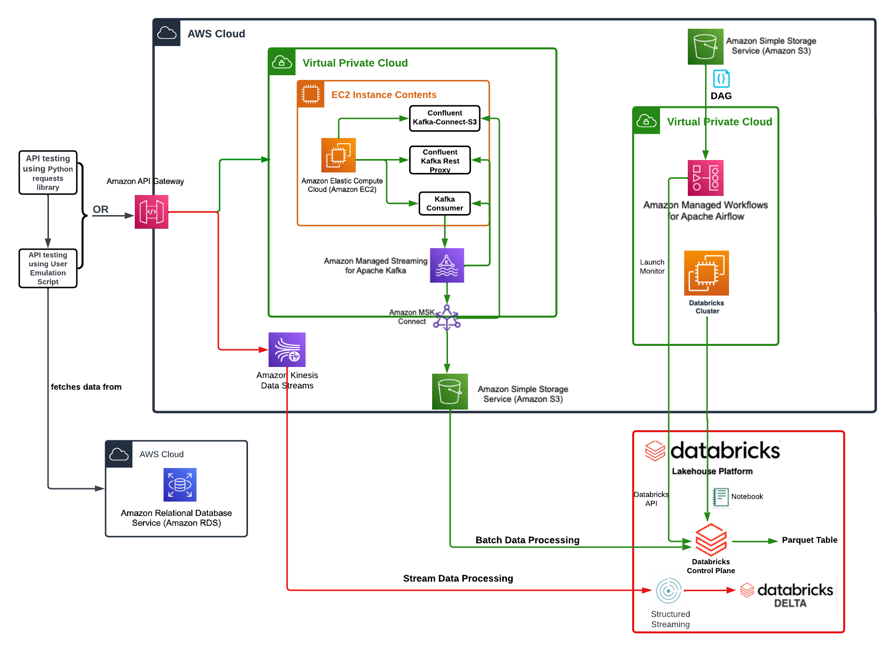

# AWS Data Pipeline Project: Emulating Pinterest's Data Handling

This repository contains an AWS-based data pipeline project designed to emulate Pinterest's approach to managing large volumes of data. The architecture integrates various AWS services with Databricks, Apache Spark, Apache Airflow, Kinesis, Kafka, and API Gateway to facilitate both batch and real-time data processing.

## Architecture Diagram

## Project Workflow

### Data Emulation

The `user_posting_emulation.py` script simulates user data postings and interacts with the database for data retrieval. It handles the serialization of datetime objects and posts data concurrently to Kafka and Kinesis streams using configured endpoints.

### Data Ingestion

Automated scripts facilitate the ingestion of simulated data into Kafka and Kinesis, managing connections, data retrieval, and the formatting and sending of data to service-specific endpoints.

### Data Processing

Databricks notebooks are central to the data processing tasks in this pipeline. They are utilized for a range of operations, including:

#### Batch Data Processing

`batch_processing_pipeline.ipynb` leverages Spark SQL within Databricks for batch processing. This part of the pipeline is crucial for storing data long-term for backup, data retention, and analytical purposes. It allows for the accumulation of large datasets over time which can be analyzed to discover trends, perform comprehensive data analysis, or generate reports. Batch processing, while typically less time-sensitive than stream processing, is scheduled to occur daily in this setup, ensuring consistent data updates and availability for analysis.

#### Stream Data Processing

`stream_processing_pipeline.ipynb` manages streaming data from AWS Kinesis, focusing on processing data in real-time. This allows for a "live view" of the data stream, enabling immediate observation and operational monitoring. It is crucial for scenarios where rapid decision-making is required, such as detecting anomalies, monitoring system health, or triggering alerts based on live data. 

#### Pipeline Utilities

`pipeline_utils.ipynb` includes utilities for managing interactions with AWS services, such as loading AWS credentials, mounting and managing S3 buckets. It also provides core functions for data transformation and processing tasks essential for both batch and stream processing pipelines.

### Data Transformation

Effective data processing requires rigorous data cleaning and transformation to ensure data quality and usability. Key steps in this process include:

- **Error Handling:** Addressing missing values and erroneous entries to maintain data integrity.
- **Data Type Conversions:** Ensuring all data types are consistent and accurately represented to avoid processing errors.
- **Data Structuring:** Renaming columns and restructuring data formats to enhance usability and facilitate easier analysis.

### Schema Definition and Stream Processing

For effective stream processing, specific schemas are defined for Pinterest posts, geolocation data, and user profiles. This structured approach ensures streamlined data manipulation and storage in Delta tables, supporting real-time analytics.

### Automation with Airflow

The project employs AWS Managed Workflows for Apache Airflow (MWAA) to automate the execution of the `batch_processing_pipeline.ipynb` notebook, ensuring that data is processed daily and efficiently. This daily schedule helps maintain regular data backup and analytics readiness without manual intervention.

## Detailed Architecture and Tools
- **Apache Kafka and AWS MSK:** Form the backbone of the data streaming infrastructure, enabling robust data ingestion and storage mechanisms.
- **Databricks and Apache Spark:** Provide the computational power for processing both batch and streaming data, facilitating rapid distributed computing and analysis.
- **AWS Kinesis:** Enhances real-time data processing capabilities, integrating seamlessly with other AWS services.
- **AWS S3:** Acts as the primary storage solution, offering durability and accessibility for processed data.
- **Amazon API Gateway:** Used for configuring endpoints for both batch and real-time data ingestion. The API Gateway facilitates communication with Kafka and Kinesis through service-specific endpoints.

## Project Structure

**Databricks Notebooks:**
- `batch_processing_pipeline.ipynb` - Handles batch data processing.
- `stream_processing_pipeline.ipynb` - Manages real-time data stream processing.
- `database_utils.ipynb` - Provides utilities for database management.

**User Posting Scripts:**
- `user_posting_emulation.py` - Simulates user data postings to Kafka and Kinesis.

**Airflow DAG:**
- `Oa5040edb649_dag.py` - Defines the workflow for automating the daily execution of the `batch_processing_pipeline.ipynb` notebook.

**Configuration Files:**
- `.gitignore`, `Oa5040edb649-key-pair.pem`, `config.json` - Includes configuration files, keys for secure connections, and AWS access details.
